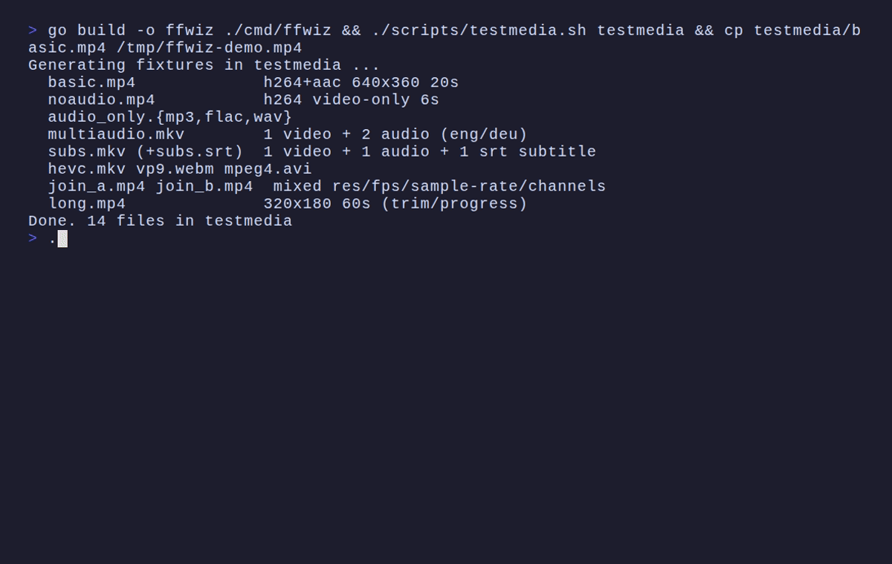

# 🎬 ffwiz

<p align="center">
    <a href="https://github.com/fsx8/ffwiz/releases">
        
    </a>
    <a href="https://github.com/fsx8/ffwiz/pkgs/container/ffwiz">
        
    </a>
    <a href="https://www.npmjs.com/package/ffwiz">
        
    </a>
    <br>
    <a href="https://github.com/fsx8/ffwiz#2-debianubuntu--apt-repository-recommended-for-servers">
        
    </a>
    <a href="https://github.com/fsx8/homebrew-tap">
        
    </a>
    <a href="https://pkg.go.dev/github.com/fsx8/ffwiz/cmd/ffwiz">
        
    </a>
    <a href="https://pkg.go.dev/github.com/fsx8/ffwiz">
        
    </a>
</p>

> Your Video editor within CLI 🚀

A powerful and user-friendly TUI (Bubble Tea) for converting, manipulating, and inspecting media files using the power of FFmpeg. It provides a simple menu-driven interface to perform common audio and video tasks without needing to memorize complex FFmpeg commands.

## 📺 Demo



## ✨ Features

- **Inspect Media Properties**: View detailed information about video and audio streams, including codecs, resolution, frame rate, bitrates, and more.
- **Convert & Transcode**: Convert videos and audio to a wide range of popular formats (MP4, MKV, WebM, MP3, FLAC, WAV, GIF) with simple quality presets.
- **Video Editing**: Resize (2160p/1080p/720p/480p presets or custom, aspect-preserving), crop, rotate (90°/180°/270°) and flip, compress with a CRF picker plus x264 speed dial, change speed (0.25x–4x, audio pitch-corrected), reverse, and losslessly mute — every operation with a live progress bar.
- **Join Videos (Concatenate)**: Combine two or more videos into a single file. The tool automatically handles differences in resolution and audio sample rates for a seamless join.
- **Trim (Cut) Videos**: Easily cut a video to a specific start and end time without re-encoding for fast, lossless clips.
- **Interactive Track Editing**: Keep/remove/convert individual video/audio/subtitle tracks and generate an FFmpeg command deterministically.
- **Screenshots**: Grab a single frame as PNG or JPG at any timestamp.
- **Metadata Editor**: Edit title/artist/comment tags or strip all metadata (including per-stream language/title tags) via lossless remux.
- **Live Progress**: Every operation streams FFmpeg's machine-readable progress into a terminal progress bar with percentage, processed/total time, ETA and encode speed — plus streamed stderr for diagnosis.
- **TUI Interface**: A modern, keyboard-friendly terminal UI built with Bubble Tea.

## 📦 Installation

<details>
<summary><b>Prerequisite: Install FFmpeg</b></summary>

> [!NOTE]
> `ffwiz` shells out to the `ffmpeg` and `ffprobe` executables. It does not bundle FFmpeg. Therefore, you must have FFmpeg installed on your system and available in your terminal's PATH.
>
> **FFmpeg 4.x is the minimum supported version**; newer major versions (5.x through 9.x) work equally well. Commands are generated to stay compatible with older builds (e.g. lossless trimming uses output-side seeking, which FFmpeg 4.x requires) and avoid options removed in recent releases.

For **macOS** users, the easiest way to install it is with [Homebrew](https://brew.sh/):

```bash
brew install ffmpeg
```

For **Windows** users, you can use a package manager like [Chocolatey](https://chocolatey.org/) or [Scoop](https://scoop.sh/):

```bash
# Using Chocolatey
choco install ffmpeg

# Using Scoop
scoop install ffmpeg
```

For **Linux** users, use your distribution's package manager:

```bash
# Debian/Ubuntu
sudo apt install ffmpeg

# Fedora
sudo dnf install ffmpeg

# Arch
sudo pacman -S ffmpeg
```

More options, static builds, and other distributions: **[ffmpeg.org/download.html](https://ffmpeg.org/download.html)**

The only exception is the Docker image below, which ships with ffmpeg bundled.

</details>

### 1. Homebrew (macOS)

```bash
brew install fsx8/tap/ffwiz
```

### 2. Debian/Ubuntu — APT repository (recommended for servers)

One command — adds the signed repository and installs (or upgrades) `ffwiz`:

```bash
curl -fsSL https://fsx8.github.io/ffwiz/install.sh | sudo bash
```

Works on any apt-based system (Ubuntu, Debian, derivatives) on `amd64` or `arm64`. The repository is GPG-signed and auto-published on every GitHub Release by `.github/workflows/apt.yml`, so `sudo apt upgrade` picks up new versions.

<details>
<summary>Manual setup (what the script does)</summary>

```bash
curl -fsSL https://fsx8.github.io/ffwiz/KEY.gpg | sudo gpg --dearmor -o /usr/share/keyrings/ffwiz-archive-keyring.gpg
echo "deb [signed-by=/usr/share/keyrings/ffwiz-archive-keyring.gpg] https://fsx8.github.io/ffwiz/apt stable main" | sudo tee /etc/apt/sources.list.d/ffwiz.list
sudo apt update && sudo apt install ffwiz
```

</details>

For a one-off install without adding the repo, you can also `apt install` a `.deb` directly (asset names use the plain architecture):

```bash
# Alternative: direct .deb install (no apt upgrade path)

# amd64
curl -LO https://github.com/fsx8/ffwiz/releases/latest/download/ffwiz_<version>_amd64.deb
sudo apt install ./ffwiz_<version>_amd64.deb

# arm64
curl -LO https://github.com/fsx8/ffwiz/releases/latest/download/ffwiz_<version>_arm64.deb
sudo apt install ./ffwiz_<version>_arm64.deb
```

### 3. Docker

```bash
docker run -it --rm -v "$PWD:/media" ghcr.io/fsx8/ffwiz
```

Multi-arch image (`linux/amd64`, `linux/arm64`) built from `Dockerfile` on every release, with ffmpeg bundled. Useful as a base image layer too: `FROM ghcr.io/fsx8/ffwiz`.

### 4. npm

```bash
npm install -g ffwiz
```

A thin wrapper package that downloads the matching prebuilt binary from the latest release at install time (needs `tar`, which ships with macOS, Linux, and Windows 10+).

### 5. go install

```bash
go install github.com/fsx8/ffwiz/cmd/ffwiz@latest
```

Requires a Go toolchain; the binary lands in `$(go env GOPATH)/bin` (make sure it's on your PATH). ffmpeg must still be installed separately.

> **Note:** building from source needs Go **1.25+** (see `go.mod`). Distro toolchains are often older (e.g. Ubuntu LTS); if `go install` fails there, use one of the prebuilt options above — the release binaries have no Go requirement.

### 6. Download from Release

If you prefer not to install a package, you can download a pre-built executable from the [Releases](https://github.com/fsx8/ffwiz/releases/latest) page.

1.  Download the executable for your operating system (Windows, macOS, or Linux).
2.  Place it in a directory with your media files.
3.  Run the executable directly from your terminal.

## 🚀 Usage

Launch the wizard from your terminal:

```bash
ffwiz                  # opens in the current directory
ffwiz video.mp4        # jump straight to the action menu for one file
ffwiz ~/Videos/        # open the join/batch wizards for a folder
```

A session walks through a handful of small screens:

1. **Main Menu** — process a single file, join multiple videos, or batch-convert a directory.
2. **File Picker** — browse media files in the working directory or type any path; type-to-filter included.
3. **Action screen** — depending on your choice:
   - **Inspect** — full ffprobe summary: container, duration, overall bitrate, and one line per stream (codec, resolution, fps / sample rate, channels).
   - **Modify Tracks** — keep (`k`) / remove (`r`) / convert (`c`) each video/audio/subtitle track, pick codecs (H.264, H.265, VP9, AV1, VP8 for video; AAC, MP3, Opus, FLAC and more for audio; SRT/ASS/mov_text for subtitles) and preview the exact generated FFmpeg command before anything runs.
   - **Trim** — lossless cut with `-c copy`; the start automatically snaps to the previous keyframe (probed via ffprobe), so mid-GOP cuts never drop or shorten the video track, and output-side seeking keeps older FFmpeg builds (e.g. 4.x) compatible.
   - **Extract Audio** — rip the audio track to MP3, FLAC or WAV; files without audio are detected up front.
   - **Resize** — 2160p/1080p/720p/480p presets or custom width/height; the free dimension auto-adjusts (even, aspect-preserving). Video re-encodes to H.264, audio is copied.
   - **Rotate / Flip / Crop** — 90°/180°/270° rotation, horizontal/vertical mirror, or region cropping (fields pre-filled with a centered suggestion from the probe).
   - **Compress** — CRF picker (18–34 plus custom 0–51) and an x264 preset speed dial (ultrafast…slower); audio copied untouched.
   - **Speed / Reverse / Mute** — speed change 0.25x–4x (`setpts` + chained `atempo`, pitch-corrected audio), reverse playback, or lossless mute (`-c copy -an`).
   - **Take Screenshot** — grab a single frame at any timestamp as PNG or JPG.
   - **Edit Metadata** — edit title/artist/comment tags, or strip all metadata (global plus per-stream language/title) via lossless remux.
   - **Join** — multi-select videos with `Space` (selection order = playback order); targets are normalized automatically — scale/pad to the first input's geometry, resample audio — then concatenated, with a confirmation step previewing the whole command.
   - **Batch Convert** — convert every media file in a directory: MP4/MKV/MOV/AVI/WebM with CRF quality presets (or stream-copy), audio-only targets, and high-quality palette-based GIFs; files without matching streams are skipped gracefully.
4. **Execution View** — live progress bar (`%`, processed/total, ETA, encode speed), streamed stderr for diagnosis, everything logged to `ffmpeg_log.txt`, and guaranteed no orphaned processes when you cancel (`Esc` / `Ctrl+C`).

The progress bar derives its total by probing the inputs up front (summing them for joins), so percentages are accurate rather than guessed. When a duration can't be determined it falls back to showing processed time with the spinner.

```text
Trimming video…

[███████████████░░░░░]  62%  01:14 / 02:00  ETA 00:38  2.4x
frame=18532 fps= 71 q=-1.0 size=  128000KiB time=00:01:14.12 bitrate=...
video:245900KiB audio:15300KiB subtitle:0KiB other streams:0KiB...

 ▪ Running… (Esc cancels • ↑/↓ scroll)
```

### ⌨️ Keyboard Reference

| Context                        | Keys                      | Action                                        |
| ------------------------------ | ------------------------- | --------------------------------------------- |
| Lists / menus                  | `↑` `↓` or `j` `k`        | Navigate                                      |
| Filterable lists               | `/` then text             | Filter items (File picker, Join selection)    |
| Any menu                       | `Enter`                   | Select                                        |
| Anywhere                       | `Esc`                     | Back / previous step (Cancel while running)   |
| Anywhere                       | `q`                       | Quit ffwiz (cancelled safely mid-run)         |
| Anywhere                       | `Ctrl+C`                  | Cancel the running job                        |
| Join selection                 | `Space`                   | Toggle/select videos (order is kept)          |
| Forms (Trim, Extract, outputs) | `Tab` `Shift+Tab` `↑` `↓` | Move between fields; `Enter` continues        |
| Track editor                   | `k` / `r` / `c`           | Keep / Remove / Convert selected track        |
| Execution view                 | `↑` `↓`                   | Scroll the log; `Enter` returns when finished |

## 🤝 Contributing

Contributions are welcome! Please see the [Contributing Guidelines](CONTRIBUTING.md) for more information.

## 🧪 Development

Requirements: a Go toolchain (**1.25+**, see `go.mod`) and FFmpeg/ffprobe in your `PATH` (ffmpeg 4.x is the compatibility floor).

### Run from source

```bash
git clone https://github.com/fsx8/ffwiz.git
cd ffwiz
go run ./cmd/ffwiz
```

### Testing

Testing is two-tiered by design:

**Unit tests** — no FFmpeg required — assert on the _generated arguments_ and UI model state. They prove ffwiz builds the right command for every feature:

```bash
go test ./...
```

**Integration tests** execute _real FFmpeg_ through every feature — trim keyframe snapping, join normalization, track editing, a 14-scenario remux matrix (over a 4K HEVC HDR fixture with DTS/EAC3/AAC audio and subtitle tracks), batch/GIF conversion, and live-progress parsing — then **probe the written output files with ffprobe** and assert codecs, stream counts, channel layouts, durations, pixel formats and metadata tags:

```bash
./scripts/testmedia.sh                    # deterministic fixtures into ./testmedia (gitignored, ~25s)
go test -tags=integration ./...           # self-skips if ffmpeg/fixtures are absent
```

Both tiers run in CI on every push.

### Demo generation

The screencast above lives at `docs/demo.gif` and can be regenerated from the [vhs](https://github.com/charmbracelet/vhs) script after building the binary (requires local `ffmpeg`):

```bash
go build -o ffwiz ./cmd/ffwiz
vhs docs/demo.tape
```

## 📄 License

This project is licensed under the MIT License. See the [LICENSE](LICENSE) file for details.
